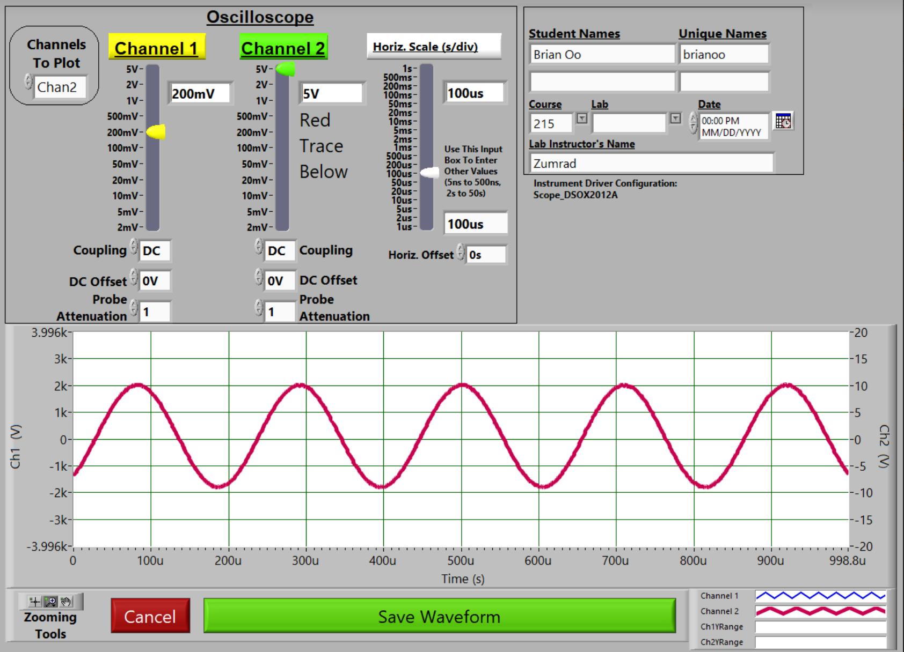

# Links to other Pages (toc)
* [Introduction to Discrete Math](intro.md)
* [Propositional Logic](proplogic.md)
* [Predicate Logic](predlogic.md)

# Heading
George Washington

Let's Do This

*Abraham* Lincoln

John Adams Once said
> Fuck that's delicious

Yes he did. I believe that this is *integral* to everything that we will do here today.

~~No~~. **Please submit your homework on _time_** 

## Now let's do something cool

### Coding for example

For example, please look in your `int main` function. Some othcollaper examples of functions are:nfl
```c++
int main(){
    cout << "Hello World" << endl;
}
```
Cool Right! Want to learn more? [Google It!](https://google.com)

### Or maybe the internet

Wanna Try Recursion. [Here](index.md)

Let's make a list of what we've done so far
* Nothing
* Everything
* Something


And what we haven't done yet?
1. Yes
2. No
3. Maybe
4. Almost

What about a nested list?
1. First item
   1. Sub items
   2. Are so weird
2. Second item

 Propositions | Truth Values
 :---: | :---:
 p | true = 1
 q | false = 0

Take a look at this weird science thing:




## Playing with Collapses Now!

<details>
    <summary>Click to expand!</summary>

woah this stuff is hidden how is this possible woaH
</details>
<p>&nbsp;</p>

#### Sample Exam Problem
How many times does the inner loop run? What is the final value of x at the end of the program?
```c++
int function(int input){
    int x = 0
    for(int i = input; input < 100; input++){
        x += 1;
    }
}
```
<details>
    <summary>Solution</summary>

The loop runs 100 - `input` times and the `x` has the same value as input.
</details>
<p>&nbsp;</p>


Tada!

### Alright Now we are gonna play with typing math
The following formula is good $$ \binom{7}{2} = 2^4 $$. Please refer to the following proof as to why this works. 

#### This is a mathmatical proof!
$$
\begin{aligned}
    x &= 1 + C \\
    Cx &= 1 \\
    \log_xC &= 1 - 45
\end{aligned}
$$

Therefore, we have just proven it works!

<details><summary markdown='span'>Solution
</summary>

1. Proposition, its truth value is true.  
2. Proposition, its truth value is false.
3. Not a Proposition, questions do not have a truth value.
4. Not a Proposition, paradoxes do not have a definite truth value.
5. Proposition, its truth value is true.
6. Not a Proposition.
</details>

Does having words after fuck u up?

