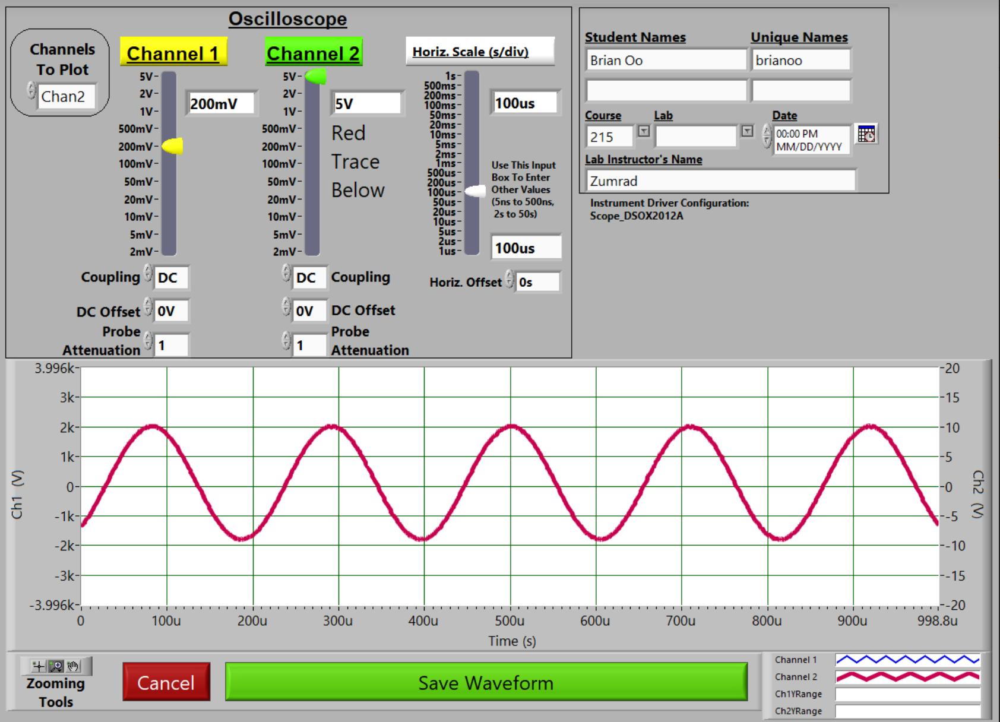

# Preview
- [Heading](#or-maybe-the-internet)
  - [Coding](#preview)


# Heading
George Washington

*Abraham* Lincoln

John Adams Once said
> Fuck that's delicious

Yes he did. I believe that this is *integral* to everything that we will do here today.

~~No~~. **Please submit your homework on _time_** 

## Now let's do something cool

### Coding for example

For example, please look in your `int main` function. Some other examples of functions are:
```C++
int main(){
    cout << "Hello World" << endl;
}
```
Cool Right! Want to learn more? [Google It!](https://google.com)

### Or maybe the internet

Wanna Try Recursion. [Here](test.md)

Let's make a list of what we've done so far
* Nothing
* Everything
* Something


And what we haven't done yet?
1. Yes
2. No
3. Maybe
4. Almost

What about a nested list?
1. First item
   1. Sub items
   2. Are so weird
2. Second item

 Propositions | Truth Values
 :---: | :---:
 p | true = 1
 q | false = 0

Take a look at this weird science thing:

 

